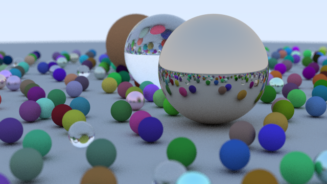

A `rust` implementation of `Ray Tracing in One Weekend` (Book by Peter Shirley). It uses `image` crate to write PNG files and `rayon` to do simple parallelization.



### How To Run

It provides examples for each chapter (3 - 12), simply do:
```bash
cargo run --release --example ch12
```

### Sources

[Ray Tracing in One Weekend](https://github.com/RayTracing/InOneWeekend)
